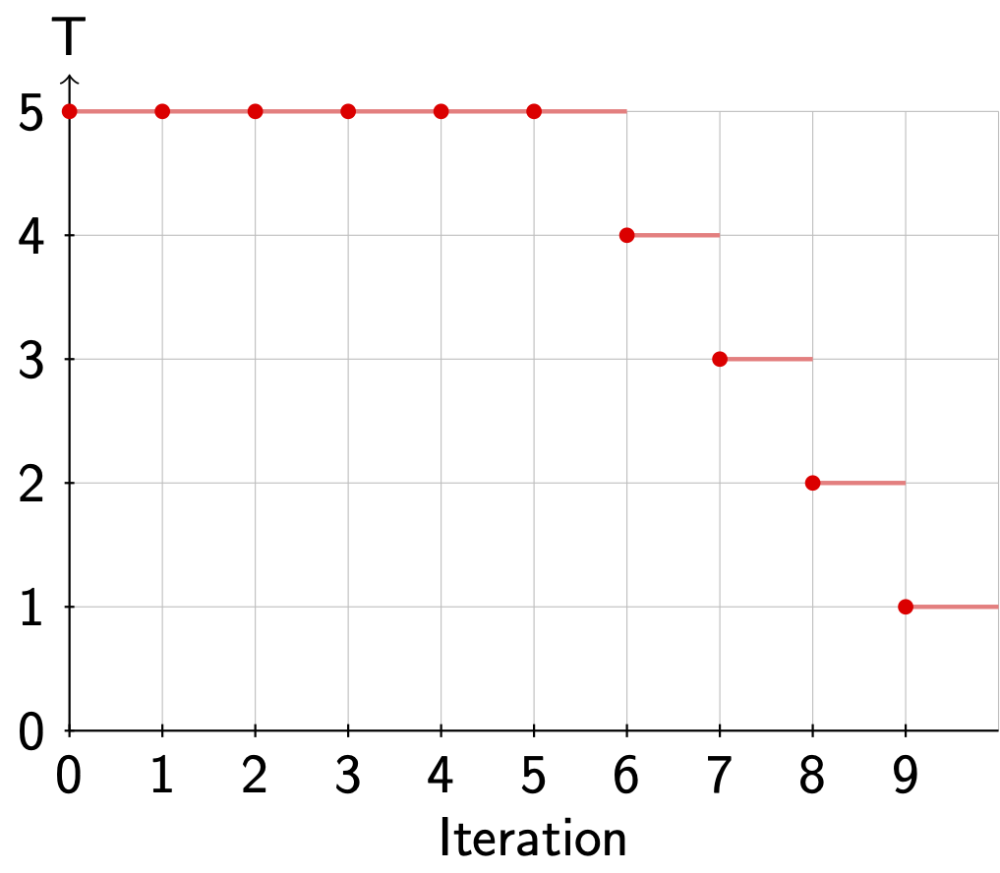
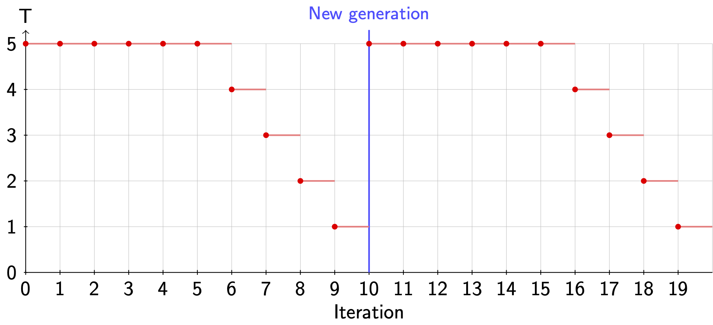

*******************************
Force Field Training Algorithms
*******************************

*This chapter was written by Juli{\'a}n Marrades and is based in part on his M.Sc. thesis :cite:p:`Marrades2022a`.*

Within the *alexandria train_ff* module of the Alexandria Chemistry Toolkit you can choose among three algorithms to optimize force field parameters:

* Markov Chain Monte Carlo (flag *-optimizer MCMC*)
* Genetic Algorithm (flag *-optimizer GA*)
* Hybrid GA/MCMC (flag *-optimizer HYBRID*)

Let us see what they do behind the scenes and how to control them.

====
MCMC
====
Assume we want to set the values for five parameters (nParam = 5) by performing ten MCMC iterations (flag *-maxiter 10*). Then, the code "reads"

.. code-block:: c++

   for (int i = 0; i < 10; i++)
     for (int j = 0; j < 5; j++)
       stepMCMC();

That is, we do 10 X 5 = 50 MCMC steps. What is a MCMC step though? In essence,

* *prevDev*: previous deviation from data
* Choose a parameter and alter it
* *newDev*: new deviation from data
* If *newDev* < *prevDev*, we accept the parameter change and continue into the next step. Else, apply Metropolis Criterion. That is, with some probability we accept the change. Otherwise, we restore the parameter to its previous value and proceed into the next step.

Now, let us add some more detail to the algorithm.

#. we already have the deviation from data of the previous step in `prevDev`.
#. we arbitrarily choose a parameter out of the `param` vector, say `param[i]`, which is bounded by its maximum `pmax[i]` and its minimum `pmin[i]`, yielding the range `prange[i] = pmax[i] - pmin[i]`. Here is where the `-step [0, 1]` flag comes into play by specifying a fraction.\\
#. we draw a value of `delta`, which is uniformly distributed in `[- step * prange[i], + step * prange[i]]` and add it to the parameter value `param[i] += delta`. If the parameter has gone beyond its maximum, we set its value to the maximum. Same goes for the minimum. 
#. we compute the deviation `newDev` from data of the modified parameter vector. If `newDev < prevDev`, we accept the change and finish the MCMC step. Otherwise, we apply the Metropolis Criterion and finish the step. Then go back to 1.

--------------------
Metropolis Criterion
--------------------
If Mathematics is your thing and you {\em really} want to know the nitty-gritty stuff, you have thorough explanations of this method on \href{https://en.wikipedia.org/wiki/Metropolis%E2%80%93Hastings_algorithm}{Wikipedia} and Shuyi Qin's Master thesis :cite:p:`Qin2021a`.
Here, we shall say that the Metropolis Criterion allows us to take steps that do not get us closer to a minimum, giving the opportunity to explore the parameter space and avoid local minima. How exactly?

The probability of accepting a "bad" parameter change is controlled by the flag *-temp T* flag and follows the equation

.. math:: prob = exp(-deltaDev/T)  

where deltaDev = newDev - prevDev. Note that the unit of temperature is the same as that of the deviation.

Given deltaDev, a higher temperature gives a higher probability  of acceptance, as `-deltaDev/T` tends to `0` and `exp(0) = 1`. On the other hand, a lower `T` gives less chances of acceptance, as `-deltaDev/T` tends to :math:`-\infty` and :math:`exp(-\infty)` = 0.

ACT gives us the possibility to lower the temperature (simulated annealing) during the MCMC optimization with the flag *-anneal [0, 1]* flag. If we use flag *-anneal 0.5*, the temperature will be flag *-temp T* until 50% of the iterations have been completed. Then, it will be linearly decreased until it reaches `0` on the last iteration.

There are two remarks to be made here:

*  The temperature is kept constant during the `nParam` MCMC steps that take place for a given iteration.
* Since division by `0` is not defined, we set `T = 1e-6` on the last iteration.

:numref:`fig-annealing` shows a schematic example of the temperature over time when we use actflag{\-maxiter 10 -temp 5 -anneal 0.5}.

   Annealing during a MCMC run.

------------------
Multiple MCMC runs
------------------
We can optimize several candidate solutions in parallel using the  *-pop_size* flag. If the *-random_init* flag is set (default), each candidate solution will be initialized arbitrarily and respecting parameter ranges. If *-norandom_init* is employed, the candidate solution(s) will be initialized as specified by the force field file(s) provided by the user.

=================
Genetic Algorithm
=================
Quoting `WikipediaGA`_

  | In computer science and operations research, a genetic algorithm is a metaheuristic 
  | inspired by the process of natural selection that belongs to the larger class of
  | evolutionary algorithms. Genetic algorithms are commonly used to generate 
  | high-quality solutions to optimization and search problems by relying on biologically inspired operators such as mutation, crossover and selection.

.. _WikipediaGA: https://en.wikipedia.org/wiki/Genetic_algorithm

In this section, we describe our implementation of a genetic algorithm for force field parameterization. If this is the first time you hear about genetic algorithms and want to acquaint yourself, we recommend you to read Chapter 2 of Steven F. van Dijk's PhD thesis :cite:p:`VanDijk2001a` and/or head over to `Youtube`_.

.. _Youtube: https://www.youtube.com/

Our implementation is based upon a class definition and an external function for computing random numbers (Listing :ref:`listing-genome` ).

.. literalinclude:: ../code/genome.c++
   :linenos:
   :language: c++
   :name: listing-genome
   :caption: Class definition.

then the genome evolution 
boils down to the code in Listing :ref:`listing-evolve` 

.. literalinclude:: ../code/evolve.c++
   :linenos:
   :language: c++
   :name: listing-evolve
   :caption: Schematic of the evolution algorithm

flag *popSize* and flag *nElites* are assumed to be even.
Let us explore the different stages of the process.

--------------
Initialization
--------------
This stage fills the `params` field in the `Genome` class, generating popSize (flag *-pop_size*) genomes.

If we are using flag *-norandom_init*, the genomes will be initialized as specified by the force field file(s) provided. If we are employing flag *-random_init*, each genome will be initialized by setting a random value for each parameter, uniformly distributed over the allowed range.

-------------------
Deviation from data
-------------------
Here we fill the `deviation` field in for each `Genome` in the population by computing the deviation from the dataset.

-------
Sorting
-------
Sorting is not a mandatory step but may be required depending on the GA components selected by the user.
We sort the population in ascending order of `deviation`. Whether we sort or not is controlled by the flag *-sort* flag.

---------
Penalties
---------
At this stage, we may alter the population if certain conditions are met, with the main goal of preventing premature convergence and enforcing solution diversity.

  | Covering such a small portion of the space you are. Broaden your search, you should. - Yoda

To that end, we have a function `penalize()` which returns `true` if the population was penalized and `false` otherwise.

For now, there are two components in this function:

* **Volume.** This option enables flag *-sort*. If the volume spanned by the population divided by the total volume of the parameter space is smaller than flag *-vfp_vol_frac_limit [0, 1]|*, the {\em worst} fraction flag *-vfp_pop_frac [0, 1]* of genomes in the population will be randomly reinitialized. If flag *-log_volume* is used, volumes will be computed in logarithmic scale. * But wait, then the volume could be negative! Yes, we have to fix that!*
    
  | Death comes equally to us all, and makes us all equal when it comes. - John Donne
  
* **Catastrophe.** Each flag *-cp_gen_interval* generations, a fraction flag *-cp_pop_frac [0, 1]* of the genomes in the population will be randomly reinitialized. Genomes to reinitialize are arbitrarily chosen.

-----------------------
Selection probabilities
-----------------------
We provide three options for computing selection probabilities:

#. Rank (flag *-prob_computer RANK*)
#. Fitness (flag *-prob_computer FITNESS*)
#. Boltzmann (flag *-prob_computer BOLTZMANN*)

The sum of the selection probabilities of the genomes in the population, is 1.

----
Rank
----
This option enables flag *-sort*.
The selection probability depends exclusively on the index (rank) of genome in the population (Listing :ref:`listing-rank`).

.. literalinclude:: ../code/rank.c++
   :language: c++
   :linenos:
   :name: listing-rank
   :caption: Calculation of the probability from the order of probabilities.

That is, the lower the index, the higher the probability of being selected.
The independence of the `deviation` avoids the possible phenomena of a genome with a very high selection probability dominating the population.

-------
Fitness
-------
The selection probability is inversely proportional to the `deviation` (Listing :ref:`listing-fitness`).

.. literalinclude:: ../code/fitness.c++
   :language: c++
   :linenos:
   :name: listing-fitness
   :caption: Calculation of the probability from the deviations from data.

---------
Boltzmann
---------
The `temperature` parameter is specified by the flag *-boltz_temp* flag and controls the smoothing of the selection probabilities (Listing :ref:`listing-boltz`). A higher value will avoid polarization in the probability values and vice versa. The flag *-boltz_anneal* flag allows us to decrease the temperature over time and has the same logic as flag *-anneal*, except that it targets the Boltzmann selection temperature and operates based on the maximum amount of generations.

.. literalinclude:: ../code/boltz.c++
   :language: c++
   :linenos:
   :name: listing-boltz
   :caption: Use of Boltzmann-weighting when calculating the probability

-------
Elitism
-------
In order to avoid losing the best candidate solutions found so far, the GA will move the top nElites flag *-n_elites* genomes, {\em unchanged}, into the new population. That means, the genome will not undergo crossover nor mutation.

When flag *-n_elites > 0*, flag *-sort* will be enabled.

---------
Selection
---------
Once the selection probabilities are computed, the population becomes a \href{https://en.wikipedia.org/wiki/Probability_density_function}{probability density function} from which we can sample genomes based on their `probability`.

As of now, only a vanilla selector is available. It only looks at the probability and can select the same genome to be `parent1` and `parent2`.

---------
Crossover
---------
With certain probability `prCross`, controlled by the flag *-pr_cross* flag, two parents will combine their parameters to form two children.
Right now, only an N-point crossover is available, where N is defined by the flag *-n_crossovers* flag.

If `N = 1`, we arbitrarily select on crossover point (`v`) and::

      v                        v
  |X|X|X|X|X|X|X|X|X|  --> |X|X|Y|Y|Y|Y|Y|Y|Y|
  |Y|Y|Y|Y|Y|Y|Y|Y|Y|  --> |Y|Y|X|X|X|X|X|X|X|

If `N = 2`, we arbitrarily select two crossover points (`v`) and::

    v     v                  v     v
  |X|X|X|X|X|X|X|X|X|  --> |X|Y|Y|Y|X|X|X|X|X|
  |Y|Y|Y|Y|Y|Y|Y|Y|Y|  --> |Y|X|X|X|Y|Y|Y|Y|Y|

If `N = 3`, we arbitrarily select three crossover points (`v`) and::

         v     v     v            v     v     v
  |X|X|X|X|X|X|X|X|X|  --> |X|X|Y|Y|Y|X|X|X|Y|
  |Y|Y|Y|Y|Y|Y|Y|Y|Y|  --> |Y|Y|X|X|X|Y|Y|Y|X| 

If `N = 4`... you get the idea (hopefully).

--------
Mutation
--------
Given the mutation probability `prMut`, controlled by flag *-pr_mut*, we iterate through the parameters. If the probability is met, we alter the parameter, otherwise, we leave it unchanged.

.. code-block:: c++
   
   for (int i = 0; i < nParams; i++)
   {
     if (random() <= prMut)
     {
       changeParam(params, i);
     }
   }

The parameter is changed in the same way as in MCMC, by a fraction of its allowed range and not allowing values outside of it. The fraction in this case is controlled by the `-percentage` flag, which has the same meaning as `-step`, but applies to GA instead of MCMC.

-----------
Termination
-----------
This stage decides whether the GA evolution should continue or halt. We allow the user to tweak the termination criteria with several flags:

#. flag *-max_generations*: evolution will halt after so many generations.
#. flag *-max_test_generations* (disabled by default): evolution will halt if in the last flag *-max_test_generations* the best `deviation` of the test set found so far has not improved.

======
HYBRID
======
Even though this optimizer has a very fancy name, it is just a GA with MCMC as its mutator engine.
When MCMC acts as a mutator, it will always alter the genomes independently of flag *-pr_mut*. Also, it is important to note that the simulated annealing by default is applied independently in each MCMC run.
For instance, in case we would use flag *-max_generations 2 -maxiter 10 -temp 5 -anneal 0.5*, :numref:`fig-anneal-hybrid` shows the temperature during the MCMC part.

   Annealing in the hybrid algorithm

However, when using the flag flag *-anneal_globally*, the starting temperature of the annealing will be decreased in steps at the beginning of each generation.

====================
Sensitivity Analysis
====================

The sensitivity analysis is a post-optimization tool that evaluates how sensitive
the total chi-squared (:math:`\chi^2`) deviation is to small changes in each
individual force field parameter. It helps identify which parameters have the most
influence on the fitting quality and whether the optimization has converged to a
well-defined minimum.

The sensitivity analysis runs automatically after parameter optimization because the
*-sensitivity* flag defaults to true. It can be disabled with *-nosensitivity*. The
analysis can also be run on an existing force field without re-training by combining
it with the *-nooptimize* and *-norandom_init* flags.

.. note::

   The sensitivity analysis is only available with the MCMC and HYBRID optimizers.
   It is not supported with the Genetic Algorithm (*-optimizer GA*).

----------------------------
Running Sensitivity Analysis
----------------------------

The sensitivity analysis runs automatically after training with MCMC or HYBRID. To
disable it, pass the *-nosensitivity* flag::

   alexandria train_ff -nosensitivity -optimizer MCMC [other flags...]

To analyze an existing force field without re-training, use::

   alexandria train_ff -nooptimize -norandom_init \
       -fc_inter -fit 'param1 param2 param3' [other flags...]

Here, *-fc_inter* selects intermolecular energy as the fitting target (alternatively
*-fc_epot* for intramolecular energy), and *-fit* specifies the space-separated
names of the parameters to analyze.

---------
Algorithm
---------

For each trainable force field parameter :math:`p_i`, the algorithm evaluates
:math:`\chi^2` at three nearby points:

* :math:`p_\mathrm{low} = \max\!\left(p_i - \delta p,\; p_\mathrm{lower}\right)` — below the current value
* :math:`p_0 = \tfrac{1}{2}\!\left(p_\mathrm{low} + p_\mathrm{high}\right)` — midpoint
* :math:`p_\mathrm{high} = \min\!\left(p_i + \delta p,\; p_\mathrm{upper}\right)` — above the current value

where :math:`\delta p = (p_\mathrm{upper} - p_\mathrm{lower}) / 200` (approximately
0.5% of the allowed range on each side of the current value) and
:math:`p_\mathrm{lower}`, :math:`p_\mathrm{upper}` are the allowed bounds for
the parameter.

The three :math:`(p,\,\chi^2)` pairs are then fit to a parabola

.. math::

   \chi^2(p) = a \cdot p^2 + b \cdot p + c

using least-squares regression. The minimum of this parabola is located at

.. math::

   p_\mathrm{opt} = -\frac{b}{2a}, \qquad
   \chi^2_\mathrm{min} = a\, p_\mathrm{opt}^2 + b\, p_\mathrm{opt} + c.

All other parameters are kept at their trained values while each parameter is
perturbed in turn, so the analysis captures the *local* sensitivity around the
training solution. The analysis is performed on the training set only.

-------------
Output Format
-------------

The sensitivity analysis writes its results to the log file. The output has the
following structure:

.. code-block:: none

   Starting sensitivity analysis. chi2_0 = 0.482  nParam = 42

   Sensitivity epsilon_OW Fit to parabola: a  1.35e+00 b -1.36e+01 c  3.44e+01
       p[0] 4.900   chi2[0] 0.496
       p[1] 5.000   chi2[1] 0.482
       p[2] 5.100   chi2[2] 0.495
       pmin 5.002  chi2min 0.482 (estimate based on parabola)

   Sensitivity C12_VDW Fit to parabola: a  4.00e-12 b -4.01e-07 c  4.82e-01
       p[0] 4.95e+04  chi2[0] 0.4820
       p[1] 5.00e+04  chi2[1] 0.4820
       p[2] 5.05e+04  chi2[2] 0.4820
       pmin 5.01e+04  chi2min 0.4820 (estimate based on parabola)

   Sensitivity analysis done.

The output fields are:

* **chi2_0** — the :math:`\chi^2` of the current (trained) parameter set before
  any perturbation.
* **nParam** — the number of trainable parameters being analyzed.
* **Parameter name** — the name of the force field parameter (interaction type and
  atom-type label).
* **a, b, c** — coefficients of the fitted parabola
  :math:`\chi^2(p) = a p^2 + b p + c`.
* **p[0], p[1], p[2]** — the three parameter values at which :math:`\chi^2` was
  evaluated.
* **chi2[0], chi2[1], chi2[2]** — the corresponding :math:`\chi^2` values.
* **pmin** — the parameter value at the estimated parabolic minimum.
* **chi2min** — the estimated minimum :math:`\chi^2` from the parabola fit.

--------------
Interpretation
--------------

The coefficient *a* of the fitted parabola quantifies how sharply :math:`\chi^2`
responds to changes in the parameter:

* **Large** :math:`|a|` — the :math:`\chi^2` surface is steeply curved near the
  current value; the parameter is *sensitive* and must be determined accurately.
  A large *a* also indicates a well-defined minimum.
* **Small** :math:`|a| \approx 0` — the :math:`\chi^2` surface is nearly flat; the
  parameter has little influence on the training targets in the explored range. Such
  parameters may be poorly constrained by the data and are candidates for fixing at
  a reasonable value or removing from the fit.

The estimated minimum (**pmin**, **chi2min**) gives a first-order estimate of the
optimal parameter value and the achievable :math:`\chi^2` from the local curvature.
If *pmin* is far from the trained value, the optimization may not have fully
converged for that parameter, or the training data does not strongly constrain it.
When *a* is very small (insensitive parameter), the estimated *pmin* extrapolates
far outside the sampled range and should be treated with caution.

If the fitted parabola has *negative* curvature (:math:`a < 0`), the current
parameter value sits at a local *maximum* of the chi-squared surface, which suggests
an ill-conditioned or degenerate optimization landscape for that parameter.

The sensitivity analysis is particularly useful for:

* Identifying insensitive (poorly constrained) parameters that can be fixed or
  removed from the fitting.
* Checking whether the optimization has converged near a well-defined minimum.
* Guiding subsequent optimization runs by revealing parameters that may benefit from
  a broader or finer search range.
